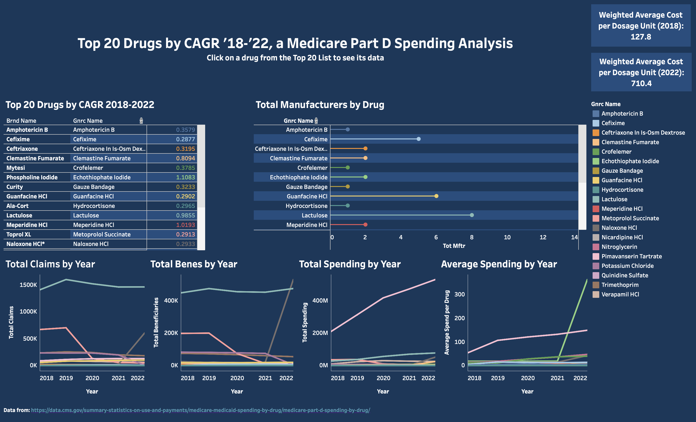

# Medicare Part D Spending Analysis (2018–2022)

This project analyzes Medicare Part D spending data from 2018 to 2022 to identify the top 20 drugs with the highest **compound annual growth rate (CAGR)** in **average spending per weighted dosage unit**. The analysis was conducted using PostgreSQL (via pgAdmin 4), and the results are visualized in an interactive dashboard built with Tableau.

## Objective

To highlight drugs with the greatest increases in cost over time, enabling Medicare or health plans to pinpoint cost drivers within Part D spending. This data-driven insight may support future cost containment strategies and drug utilization review.

## Dashboard Overview

The Tableau dashboard includes:

- A ranked list of the **top 20 drugs by CAGR** in average spending per weighted dosage unit (2018–2022)
- Interactive drill-down functionality – selecting a drug from the list updates all associated charts
- Badges displaying **average cost per dosage unit** in 2018 and 2022
- Charts showing year-by-year values for:
  - Total claims
  - Total beneficiaries
  - Total spending
  - Total manufacturers
  - Average spending per dosage unit (weighted)
- By default, the dashboard displays data for all top 20 drugs for easy comparison

**[View the Interactive Dashboard on Tableau Public](https://public.tableau.com/views/MedicarePartDSpendingAnalysis/Top20DrugsbyCAGR2018-2022aMedicarePartDSpendingAnalysis?:language=en-US&publish=yes&:sid=&:redirect=auth&:display_count=n&:origin=viz_share_link)**

## Data Source

- [Medicare Part D Spending by Drug – CMS.gov](https://data.cms.gov/summary-statistics-on-use-and-payments/medicare-medicaid-spending-by-drug/medicare-part-d-spending-by-drug/)  
  Published by the Centers for Medicare & Medicaid Services (CMS), this dataset includes yearly spending, claims, and beneficiary counts for each Part D-covered drug.

## Key Insights

- Focuses on **cost growth** rather than just total cost to highlight emerging trends
- All visualizations reflect only the **top 20 drugs**, ensuring a targeted and focused analysis
- Outlier data points are filtered out using logic in SQL to maintain reliability and integrity of CAGR values

## Tools Used

- **PostgreSQL (pgAdmin 4)** – Used for all data querying, cleaning, and transformation
- **Tableau** – Used to build an interactive dashboard for exploring cost trends

## SQL Queries

All SQL logic is organized in the [`sql/`](./sql/) folder. Files include:

- `create_part_d_table.sql` – Table schema for Part D spending data
- `top20_cagr_analysis.sql` – Identifies the top 20 drugs by CAGR in spending
- `unnest_top20_claims.sql` – Year-by-year claim totals for top 20 drugs
- `unnest_top20_benes.sql` – Year-by-year beneficiary counts
- `unnest_top20_spending.sql` – Year-by-year total spending
- `unnest_top20_avg_spending.sql` – Year-by-year average spending per dosage unit (weighted)

## Skills Demonstrated

- Writing complex SQL queries in PostgreSQL
- Transforming wide-format healthcare cost data into long format using `UNNEST()` and `LATERAL JOIN`
- Calculating and interpreting financial trends using CAGR
- Creating drill-down, filterable dashboards in Tableau
- Presenting Medicare cost drivers in a clear, actionable format for healthcare stakeholders
